# Fairshare Backend — High-Level Design (HLD)

---

## 1. Overview

The Fairshare backend (`fairshare_be`) is an enterprise-grade **Java 21 + Spring Boot 3.3+ modular monolith** built using **Apache Maven (`mvn`)**. It exposes secure RESTful APIs, WebSocket real-time event broadcasting, and automated scheduled jobs (bill due-date tracking, money request expirations).

---

## 2. Tech Stack Matrix

| Layer | Technology | Choice Rationale |
| :--- | :--- | :--- |
| **Build & Dependency Management** | **Apache Maven 3.9+ (`pom.xml` / `mvnw`)** | Declarative lifecycle, industry standard plugins, deterministic dependency tree, reproducible packaging |
| **Language & Runtime** | **Java 21 (LTS) / OpenJDK 25** | Virtual threads (Project Loom) for high concurrency, Records for immutable DTOs, Pattern Matching |
| **Core Framework** | **Spring Boot 3.3+** | Modular monolith design, Spring Security 6, Spring Data JPA, Spring WebSocket, Spring Validation |
| **Primary Relational Database** | **NeonDB (Serverless PostgreSQL 16+)** / Local Docker Postgres | Strict ACID compliance for financial ledgers, transactional DDL, check constraints, JSONB support |
| **ORM & Persistence** | **Hibernate 6 + Spring Data JPA** | Repositories, declarative `@Transactional` boundaries, `@Version` optimistic locking |
| **Database Migrations** | **Flyway 10+** | Version-controlled SQL migration scripts (`V1__...sql`) executed on startup |
| **In-Memory Cache & Token Store** | **Redis Cloud** / Local Redis 7 | JWT refresh token storage & rotation, rate limiting, and distributed WebSocket Pub/Sub broker |
| **Authentication & Multi-OAuth** | **Spring Security 6 (OAuth2 Client + JWT)** | Google OAuth2 authorization code flow + Email/Password (BCrypt), short-lived stateless JWT access tokens |
| **API Documentation** | **SpringDoc OpenAPI 2.5+ (Swagger UI)** | Interactive API test suite accessible at `/swagger-ui.html` |
| **Scheduling Engine** | **Spring `@Scheduled`** | Automated cron jobs for due-bill status updates and money request expiration checks |
| **Real-Time Communication** | **Spring WebSocket (STOMP over SockJS)** | Group expense & settlement live sync across connected clients backed by Redis Pub/Sub |
| **Reverse Proxy & Ingress** | **NGINX Alpine** | SSL termination, reverse proxy to `/api/*` and `/ws/*`, gzip compression, and rate limiting |
| **Containerization** | **Docker & Docker Compose** | Multi-stage Dockerfile using Maven and Eclipse Temurin JRE |

---

## 3. System Architecture Diagram

```mermaid
flowchart TB
    subgraph Clients["Client Layer (fairshare)"]
        Web["React 19 PWA\n(Vite + TypeScript)"]
        Mobile["Capacitor Mobile Shell\n(Android / iOS)"]
    end

    subgraph Ingress["Edge & Ingress"]
        Nginx["NGINX Reverse Proxy\n(Port 80/443, SSL, Gzip, Rate Limiting)"]
    end

    subgraph Backend["fairshare_be (Spring Boot 3.3 Modular Monolith)"]
        direction TB

        subgraph Shared["shared module"]
            SecurityConfig["SecurityConfig\n(CORS, Stateless Filter Chain)"]
            JwtFilter["JwtAuthenticationFilter\n(Bearer Token Extraction & Validation)"]
            JwtProvider["JwtTokenProvider\n(HMAC-SHA256 Token Issuance & Verification)"]
            GlobalEx["GlobalExceptionHandler\n(RFC 7807 Standard Error Responses)"]
        end

        subgraph Auth["auth module"]
            AuthCtrl["AuthController\n(/api/v1/auth/*)"]
            AuthSvc["AuthService"]
            GoogleOAuth["GoogleOAuth2Handler\n(OAuth2 Authorization Code Exchange)"]
        end

        subgraph Users["user module"]
            UserCtrl["UserController\n(/api/v1/users/*)"]
            UserSvc["UserService"]
            ContactSvc["ContactService\n(MSISDN lookup & sync)"]
            OnboardSvc["OnboardingService\n(Multi-journey step tracking)"]
        end

        subgraph Groups["group module"]
            GroupCtrl["GroupController\n(/api/v1/groups/*)"]
            GroupSvc["GroupService\n(Member roles, authorization)"]
        end

        subgraph Expenses["expense module"]
            ExpCtrl["ExpenseController\n(/api/v1/groups/{id}/expenses)"]
            ExpSvc["ExpenseService\n(Idempotent writes, audit trail)"]
            SplitCalc["SplitCalculator\n(Deterministic Integer Rounding)"]
            BalanceSvc["BalanceService\n(Net Balances Invariant: Sum == 0)"]
            DebtSimp["DebtSimplifier\n(Min-Cash-Flow Greedy O(N log N))"]
        end

        subgraph Payments["payment module"]
            PayCtrl["PaymentController\n(/api/v1/groups/{id}/payments)"]
            PaySvc["PaymentService\n(Settlement Recording)"]
        end

        subgraph Billing["billing module"]
            BillCtrl["UpcomingBillController\n(/api/v1/bills/*)"]
            BillSvc["UpcomingBillService"]
            BillCron["BillDueScheduler\n(@Scheduled daily cron)"]
        end

        subgraph Requests["request module"]
            ReqCtrl["MoneyRequestController\n(/api/v1/requests/*)"]
            ReqSvc["MoneyRequestService"]
            ReqCron["RequestExpiryJob\n(@Scheduled 15-min cron)"]
        end

        subgraph Activity["activity module"]
            ActCtrl["ActivityController\n(/api/v1/activity/*)"]
            ActSvc["ActivityService\n(Synchronous Transactional Audit)"]
        end

        subgraph Realtime["realtime module"]
            WsConfig["WebSocketConfig\n(STOMP over SockJS)"]
            Broadcaster["EventBroadcaster\n(Redis Pub/Sub Sync)"]
        end

        subgraph Admin["admin module"]
            AdminCtrl["AdminController\n(/api/v1/admin/*)"]
            RumSvc["RumAnalyticsService\n(Real-Time User Monitoring)"]
        end
    end

    subgraph DataLayer["Persistence & Caching"]
        NeonDB[(NeonDB Cloud / PostgreSQL 16\nACID Ledger & Partitioned Telemetry)]
        Redis[(Redis Cloud / Redis 7\nRefresh Tokens, Rate Limiting, Pub/Sub)]
        MinIO[(MinIO / S3\nReceipts & Avatars - Phase 3)]
    end

    Clients -->|HTTPS / WSS| Nginx
    Nginx -->|/api/*| Backend
    Nginx -->|/ws/*| Realtime
    Nginx -->|Static Assets| Web

    Auth --> NeonDB
    Auth --> Redis
    Users --> NeonDB
    Groups --> NeonDB
    Expenses --> NeonDB
    Payments --> NeonDB
    Billing --> NeonDB
    Requests --> NeonDB
    Activity --> NeonDB
    Admin --> NeonDB
    Admin --> Redis
    Broadcaster --> Redis
```



---

## 4. Maven Modular Monolith Structure

The backend code is organized into clean domain modules within a standard Maven layout:

```
fairshare_be/
├── pom.xml
├── mvnw
├── mvnw.cmd
├── .mvn/
│   └── wrapper/
│       └── maven-wrapper.properties
├── Dockerfile
├── docker-compose.yml
├── backend_hld.md
├── backend_lld.md
└── src/
    ├── main/
    │   ├── java/com/fairshare/
    │   │   ├── FairshareApplication.java
    │   │   ├── shared/
    │   │   │   ├── config/ (SecurityConfig, RedisConfig, WebSocketConfig, SwaggerConfig, CorsConfig)
    │   │   │   ├── security/ (JwtTokenProvider, JwtAuthenticationFilter, UserPrincipal)
    │   │   │   ├── exception/ (GlobalExceptionHandler, ResourceNotFoundException, BadRequestException)
    │   │   │   └── dto/ (ApiResponse)
    │   │   ├── auth/ (controller, service, dto, oauth/GoogleOAuth2Handler)
    │   │   ├── user/ (controller, service, model, repository, dto)
    │   │   ├── group/ (controller, service, model, repository, dto)
    │   │   ├── expense/ (controller, service, engine/SplitCalculator, engine/DebtSimplifier, model, repository, dto)
    │   │   ├── payment/ (controller, service, model, repository, dto)
    │   │   ├── billing/ (controller, service, scheduler/BillDueScheduler, model, repository, dto)
    │   │   ├── request/ (controller, service, scheduler/RequestExpiryJob, model, repository, dto)
    │   │   ├── activity/ (controller, service, model, repository, dto)
    │   │   ├── realtime/ (service/EventBroadcaster)
    │   │   └── admin/ (controller, service/RumAnalyticsService, dto)
    │   └── resources/
    │       ├── application.yml
    │       ├── application-dev.yml
    │       ├── application-prod.yml
    │       └── db/migration/
    │           └── V1__initial_schema.sql
    └── test/
        └── java/com/fairshare/
            ├── auth/AuthControllerTest.java
            ├── expense/SplitCalculatorTest.java
            ├── expense/DebtSimplifierTest.java
            ├── expense/ExpenseServiceTest.java
            └── billing/BillDueSchedulerTest.java
```

---

## 5. Security & Authentication Architecture

### 5.1 Multi-OAuth and Credential Model
- **Dual Authentication**:
  - Classic Email & Password: Encrypted with BCrypt (strength 10), stored in `users.password_hash`.
  - Google OAuth2: Handled via authorization code grant; extracts verified `email`, `sub`, `name`, `picture`.
- **User Identity Federation**:
  - `user_identities` table allows multiple OAuth providers (Google, GitHub, Apple) to link to a single `users` profile.
  - Logging in with Google matches on `provider_user_id` or links via confirmed email.
- **Stateless Tokens with Redis Revocation**:
  - Short-lived Access Token (JWT, 15 minutes, HMAC-SHA256).
  - Sliding Refresh Token (Opaque UUID, stored in Redis with 30-day TTL).
  - Explicit logout deletes the refresh token in Redis immediately.

---

## 6. Real-Time WebSocket & Scheduled Jobs

1. **WebSocket (STOMP over SockJS)**:
   - Topic destination: `/topic/group/{groupId}`
   - Clients automatically receive real-time balance updates, newly posted expenses, and settlement receipts.
   - Backed by Redis Pub/Sub so multiple backend nodes can scale horizontally without dropped events.
2. **Automated Scheduled Jobs (`@Scheduled`)**:
   - `BillDueScheduler`: Runs daily at `00:00:00 UTC`. Automatically flags past-due pending bills as `overdue`.
   - `RequestExpiryJob`: Runs every 15 minutes. Automatically updates expired money requests from `open` to `expired` for transparent defaulter accountability.
